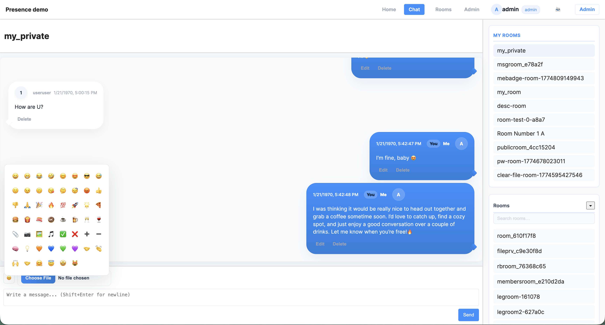
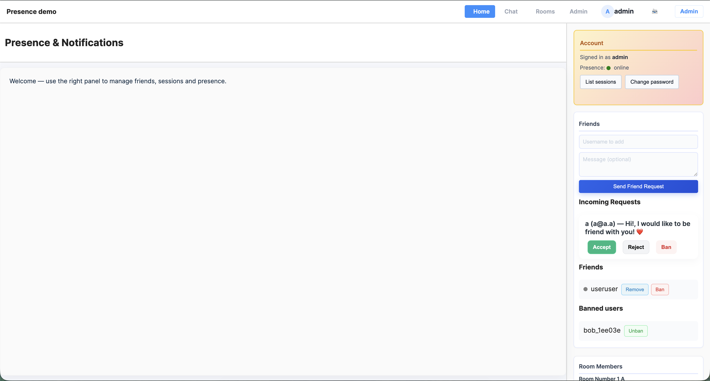
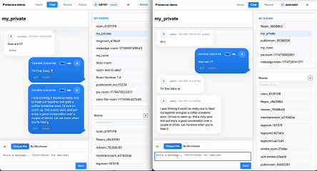
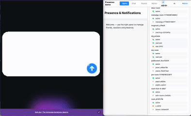

# Real-Time Chat Application (FastAPI + SQLite)

A production-style web chat system supporting authentication, real-time presence, private messaging, file sharing, and moderation — designed for ~300 concurrent users.

## Overview

This application implements a **classic web chat experience** with straightforward navigation and standard chat features:

- 👤 **User Accounts**: Registration, authentication, password management, session management across multiple devices
 - 💬 **Chat Rooms**: Public discoverable rooms and private invitation-only rooms with flexible membership

## � Why this project

This project focuses on solving real-world backend challenges that are common in chat and collaboration platforms. It demonstrates practical solutions for maintaining user presence across multiple sessions, enforcing access controls, and keeping large volumes of message history reliably available.

- Multi-session presence tracking (multi-tab support)
- Consistent state management (rooms, bans, permissions)
- Scalable message history (10k+ messages)
- Secure file access control

These features make the application suitable as a reference implementation for teams building chat-based products or for engineers learning how to design resilient, auditable chat backends with clear permission boundaries and predictable user experience.

## ✨ Features (short)

- Authentication & session management (multi-device)
- Real-time presence (online / AFK / offline)
- Chat rooms (public + private / invites)
- Direct (one-to-one) messaging
- File & image sharing with access control
- Moderation: owner & admin roles, message deletion, bans
- Robust message history + infinite scroll
- Simple, dependency-light frontend (vanilla JS)

## �🚀 Demo





## 🏗️ Architecture (short)

- FastAPI (async backend)
- SQLite (persistent, file-based storage)
- JWT authentication (HttpOnly cookies)
- Polling-based presence + multi-tab support
- Vanilla JS frontend (no heavy frameworks)
- Local file storage for uploads
- Docker Compose for local dev

See full architecture → [docs/architecture.md](./docs/architecture.md)
GIF demos (included in `docs/gif`):

<figure align="center">
	
	<figcaption>Send a message — quick demo of composing and sending text and attachments.</figcaption>
</figure>

<figure align="center">
	
	<figcaption>Presence change — shows online → AFK → offline transitions across tabs.</figcaption>
</figure>

## Quick start

Use Docker for the easiest reproducible run. For a minimal local start, use the manual commands below.

Docker (recommended)

```bash
# Build and run the app (DB/uploads are bind-mounted by the compose file)
docker compose up --build
```

Manual (local)

```bash
# venv, deps, run
python -m venv .venv && source .venv/bin/activate
pip install -r requirements.txt
uvicorn app:app --reload --host 127.0.0.1 --port 8000
```

Notes

- If you need test-only endpoints, set `TEST_MODE=1` in your environment before starting Docker or the server (e.g. `TEST_MODE=1 docker compose up --build`). Do not append `TEST_MODE=1` after `docker compose up` — that will be treated as a service name.
- Keep `auth.db` and `uploads/` persisted on the host (or set `AUTH_DB_PATH`) to preserve data between runs.

Note for contributors: consider installing the dev dependencies for local development and testing:
```bash
pip install -r requirements-dev.txt
```

Running tests

```bash
# Run unit tests (all under tests/unit)
pytest -q tests/unit

# Run the full test suite
pytest -q
```
